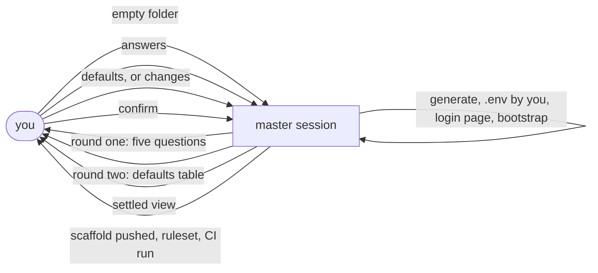
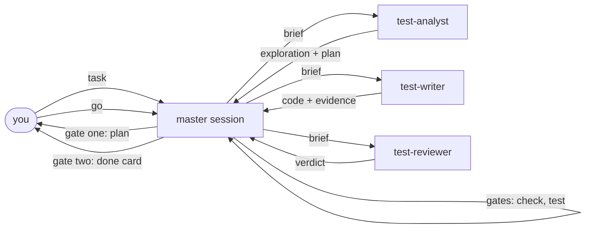

# agent-tests-playbook

A Claude Code plugin that turns one session into a test automation team for Playwright + TypeScript.

You type a door. Agents explore the product in a real browser, plan, write, review and debug. You decide at two gates. Every test is proven to fail before it counts.

## The doors

| Door | Type it when | Ends with |
| --- | --- | --- |
| `/init-project` | an empty folder needs a test project | a runnable project, pushed, protected, CI green |
| `/add-tests <task>` | a task needs tests | verified tests on the working tree |
| `/fix-tests [run]` | a run is red, locally or on CI | the cause fixed and proven, or a bug written |
| `/explore-product [area]` | coverage is unknown | gaps by risk, with candidate criteria |

## How `/init-project` runs



- **Round one** asks what nobody can look up: the target, the environments, the accounts, where the code lives, the main branch.
- **Facts** are read, never asked: the test id attribute from the page, the workers from your cores, the remote, whether the site answers.
- **Round two** is one table of defaults, accepted with `defaults` or changed by row number.
- **The settled view** shows three small tables and what will happen; you confirm once.
- **Then it builds**: the project from the template, the login page object from a snapshot, the gates run, the scaffold pushed to `main`, branches protected, CI run once.

## How `/add-tests` runs



- **The master** briefs each agent with one file, checks the handoff it gets back, and runs the gates itself.
- **The analyst** walks the product through the Playwright test MCP server and writes the plan.
- **The writer** implements one test at a time, walks each step live first, and proves every test can fail.
- **The reviewer** reads the diff with a fresh context, against the plan and the rules.
- **The debugger** takes a red test to its cause. A wait, a retry or a skip is never a fix.

## What you see

- A plan card: requirements as understood, questions with a recommended answer each, a test table.
- A done card: files, an evidence table with one prove-it-can-fail line per test, the review verdict.
- Nothing committed by an agent. Ship happens on your word, through the project's `CLAUDE.md`.

## What is inside

| Folder | Holds |
| --- | --- |
| `rules/` | twelve files that say what good work is: requirements, criteria, planning, automation, coding, testing, verification, reviewing, debugging, delivery, environment, general |
| `skills/` | the four doors, and seven steps the agents run: bootstrap, explore, plan, write, verify, review, debug |
| `agents/` | test-analyst, test-writer, test-reviewer, test-debugger |
| `templates/project/` | the project `/init-project` generates: strict TypeScript, ESLint with the Playwright plugin, one config, login setup, tags, GitHub Actions |
| `templates/handoffs/` | the documents agents pass each other, one fixed shape each |

## How to

Requirements: Claude Code, Bun or npm, Node 22, `gh` logged in, Playwright 1.63 or later.

**Start a project**

```
mkdir my-tests && cd my-tests
claude --plugin-dir /path/to/agent-tests-playbook
/agent-tests-playbook:init-project my-tests
```

Five questions you must answer, then a table you can accept with `defaults`.

**Add tests**

```
/agent-tests-playbook:add-tests search shows items for a matching word
```

Reply `go` at gate one, review the files at gate two, then say `ship into releases/<name>`.

**Fix a red run**

```
/agent-tests-playbook:fix-tests 35973231252
```

A CI run id, a spec path, or nothing for the last local run.

**Find gaps**

```
/agent-tests-playbook:explore-product cart
```

**Run without a human**

```
claude --plugin-dir /path/to/agent-tests-playbook -p "/agent-tests-playbook:add-tests <task>" --output-format json
claude -p "go" --resume <session_id>
```

Every door stops at its gates; resume it with the answer.

## Sources

Distilled, never copied. `SOURCES.md` maps each skill to what it drew from.

| Area | Drawn from |
| --- | --- |
| exploring and planning | Playwright's planner agent; Matt Pocock's what-to-test and to-spec; qaskills test-plan-generation, ISTQB techniques, boundary values, charters, coverage gaps |
| writing tests | Playwright's generator agent; currents.dev best practices; qaskills playwright-e2e, locator-filter, test-step, test-data-factory; jeffallan playwright-expert; Matt Pocock's tdd |
| verifying and reviewing | superpowers verification-before-completion and code review skills; Matt Pocock's code-review; wshobson code-review-excellence; qaskills pr-test-coverage-review |
| debugging | Playwright's healer agent; superpowers systematic-debugging; Matt Pocock's diagnosing-bugs; qaskills flaky-test-doctor, quarantine, self-healing locators, bug reports |
| writing the skills | Matt Pocock's writing-for-agents and grill-me |

## Status

0.1.0. `/init-project` and `/add-tests` have run end to end on a public demo shop. `/fix-tests` and `/explore-product` are written, not yet exercised.
