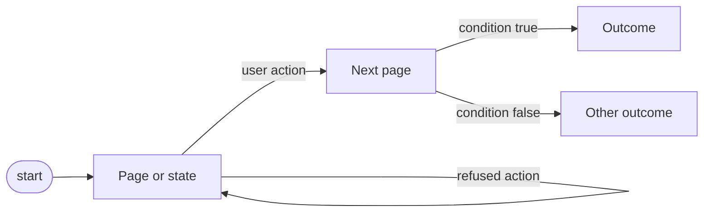
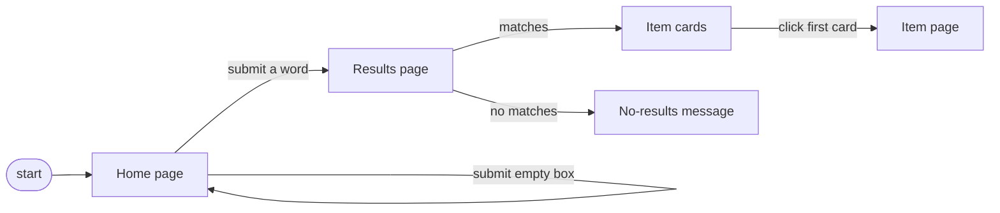

# Planning rules
<!-- version: 2026-09-23 -->

## Purpose
How to go from acceptance criteria to an ordered list of tests worth writing. The result is the test plan handoff: criteria, flow model, paths, tests in order, deferred paths, risks. Loaded by test-analyst through the `plan` skill.

## Rules
1. Plan from a model, not from a list of ideas. Draw the user flow as a Mermaid flowchart: pages or states are nodes, user actions are edges, choices are branches. Only nodes and edges seen in the locator map or in a snapshot go into the model.
2. One diagram per flow, about ten nodes. A bigger flow is two diagrams.
3. Derive paths from the model: every edge at least once, every branch both ways. Each path is one test candidate, named by its edges.
4. Check paths and criteria against each other. A path with no criterion is a gap: write it as a question for the human, do not invent the outcome. The same for a partition, boundary or rule whose outcome no criterion states. A criterion with no path means re-explore; an edge that cannot be seen on the site makes the criterion not verifiable, not an edge.
5. Add data variations with a named technique: partition, one value per class of input; boundary, each limit and its neighbour just outside it; decision table, when rules interact. Variations of one path are parametrized cases of one test, never new tests.
6. Moves that should be refused or do nothing are half the work: empty input, nothing found, a step out of order. Put each one in the model as an edge to a no-change or message node.
7. Order by risk and value: what a user would notice first if broken, what changes most often, what is hardest to get right. The first test in the plan is the one you would keep if you could keep only one. Write the reason for the order in one line.
8. Size to the time box given in the brief. Paths left out go under Later with the reason; edge paths go there first when time is short. Nothing is dropped silently.
9. Every planned test has: id, the criterion it proves, its path, its technique, a tag, its data, files to reuse, files to create, and its flakiness risks. The level tag is `@smoke` for tests proving required criteria, `@regression` for the rest; grouping tags, when the project uses them, follow it. For a test that writes data, Data also says how the Given state is created and removed.
10. Write the plan for a writer who has never seen the project: file names, reuse before create, nothing left to guess. Then stop for the human gate.

## Flow model format


## Plan entry format
```
T<n>      <behaviour sentence>                    AC-<n> | @smoke or @regression
Path      P<n> <node> -action-> <node> -condition-> <node>
Technique path | partition | boundary | decision table
Data      <exact values, or shape when they change per visit>
Reuse     <existing files>
Create    <new files>
Risk      <flakiness sources, or none>
```

## Example: from criteria to plan
Continues the acceptance-criteria example.

```
Model note: exploration confirmed that submitting an empty box keeps the home page unchanged.

Paths
P1  Home -submit word-> Results -matches-> Cards                     AC-1
P2  Home -submit word-> Results -no matches-> Empty                  AC-3
P3  Home -submit word-> Results -matches-> Cards -click first-> Item AC-2
P4  Home -submit empty box-> Home                                    no criterion: gap

Gap
P4 has no criterion. Q3, asked with the criteria, is still open: should submitting an empty box keep the user on the home page? Recommended: yes, and one test for it, because it is one click away for every user.

Tests in order
Order: T1 first because every buyer starts with a search; T2 next because a wrong card link loses the buyer; T3 last because it is the rarest case.

T1        Search shows item cards for a matching word     AC-1 | @smoke
Path      P1 Home -submit word-> Results -matches-> Cards
Technique path, partition on the word: one word that matches
Data      "watch"
Reuse     src/pages/home.page.ts
Create    src/data/search-cases.ts, src/pages/search-results.page.ts, tests/search/search.spec.ts
Risk      card count varies per visit: assert at least one, never an exact number

T2        Opening the first card shows its item page      AC-2 | @smoke
Path      P3 Home -submit word-> Results -matches-> Cards -click first-> Item
Technique path
Data      "watch"; the card title is read at run time, not hard-coded
Reuse     src/pages/home.page.ts, src/pages/search-results.page.ts from T1
Create    src/pages/item.page.ts
Risk      the first card changes per visit: its title is read at run time, never hard-coded

T3        Search for a word with no matches says so       AC-3 | @regression
Path      P2 Home -submit word-> Results -no matches-> Empty
Technique partition on the word: one word that matches nothing
Data      "zzqxv"
Reuse     everything from T1
Create    nothing
Risk      none

Later
P4  waits for the answer to Q3.
```

## Checklist
- Does every node and edge in the model come from the locator map or a snapshot?
- Does the path list cover every edge at least once and every branch both ways?
- Is every path matched to a criterion or written as a gap question, and every criterion matched to a path?
- Are refused and no-change moves in the model?
- Is every path with a criterion either a planned test or under Later with a reason?
- Could a writer with no context start from this plan without asking?
